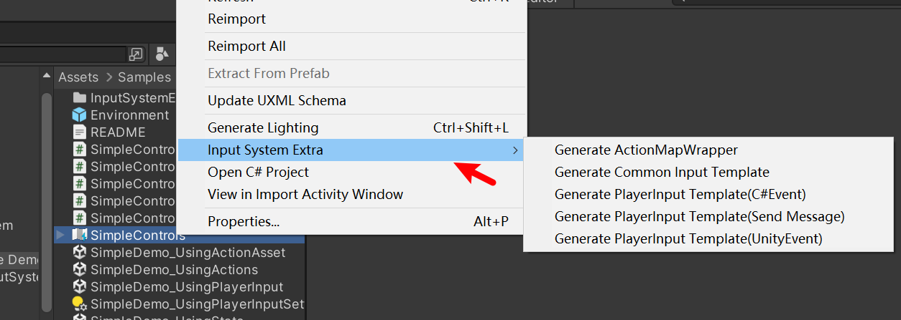

### Input System Extra

Unity Input System 轻量级扩展工具
本工具为 Unity Input System 提供对应的代码生成功能，通过解析 InputActionAsset 资源自动生成类型安全的输入调用代码，提升开发效率与运行时性能。
#### CommonInputManager
CommonInputManager 是一个继承自 MonoBehaviour 的单例管理器，负责：
集中管理所有输入映射（Action Map）的生命周期
提供静态接口简化输入注册与事件监听
通过组合生成的 ActionMapWrapper 实现快速调用
#### Gen ActionMapWrapper
在 Project 窗口右键点击 InputActionAsset
选择菜单 "Generate ActionMapWrapper"（如图所示）

选择Gen ActionMapWrapper，选择生成Wrapper脚本的路径。
之后就可以把Wrapper挂在CommonInputManager的同一个GameObject上。
#### 生成CommonInput的输入模板
在InputActionAsset资源右键选择如图菜单：

选择Gen Common Input Template，选择要生成的Map和生成模板的路径。
生成后就是一个C#脚本，里面包含了map里所有输入的声明和调用。
#### 生成PlayerInput 对应的输入模板
如果是用PlayerInput做Input接口，可以在菜单里选择Gen PlayerInput Template。
根据PlayerInput的Behavior类型不同，可以生成不同类型的模板。

Here is a simple extension for the Unity Input System. It can generate efficient code based on the InputActionAsset resource for quick runtime invocation of inputs.
#### CommonInputManager
CommonInputManager is a Mono singleton. By attaching the generated ActionMapWrapper script to the same GameObject as this manager, you can manage map activation and register inputs through this singleton.
#### Gen ActionMapWrapper
Right-click on the InputActionAsset resource and select the menu as shown:

Choose Gen ActionMapWrapper and specify the path to generate the Wrapper script.
Attach the Wrapper to the same GameObject as CommonInputManager.
#### Generate Common Input Corresponding Input Template
Right-click on the InputActionAsset resource and select the menu as 
Choose Gen Common Input Template, select the target map and the generation path.
The generated C# script will contain declarations and invocations for all inputs in the map.
#### Generate PlayerInput Corresponding Input Template
For inputs using PlayerInput as the interface, select Gen PlayerInput Template from the menu. Different template types will be generated based on the Behavior type of PlayerInput.